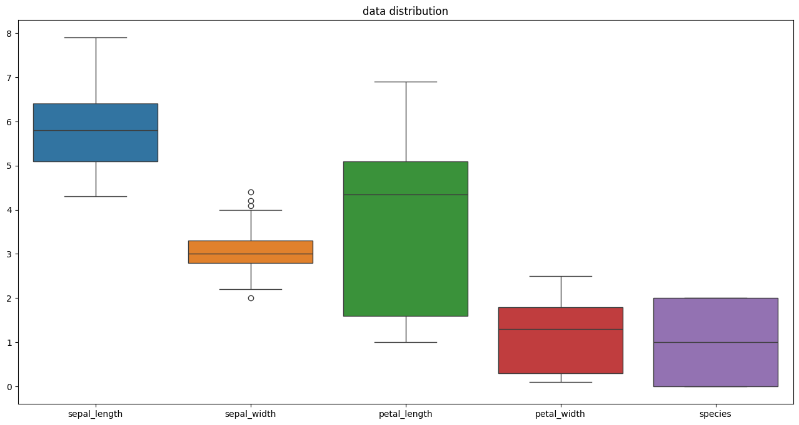

# 🌸 Iris Classification Project 🌸

Welcome to the **Iris Classification Project**! This project demonstrates the application of machine learning algorithms to classify Iris flowers into three species based on their physical characteristics. 🌼

## 📚 Dataset

The Iris dataset is a classic dataset in the field of machine learning and statistics. It consists of 150 samples, each with four features:

- **Sepal length** (cm)
- **Sepal width** (cm)
- **Petal length** (cm)
- **Petal width** (cm)

Each sample is classified into one of three species:

- **Setosa**
- **Versicolor**
- **Virginica**

## 🚀 Getting Started

### Prerequisites

Make sure you have the following packages installed:

- `Python 3.x`
- `scikit-learn`
- `pandas`
- `numpy`
- `matplotlib`
- `seaborn`

You can install these dependencies using pip:

```bash
pip install scikit-learn pandas numpy matplotlib seaborn
```

## 📊 Visualization

Visualizing the data helps in understanding the distribution and relationships between different features. Here's an example of a pair plot:



## 💻 Usage

1. **Load the Dataset:** The Iris dataset can be loaded directly from scikit-learn.
2. **Preprocess the Data:** Encode categorical variables if necessary.
3. **Split the Data:** Divide the dataset into training and testing sets.
4. **Train Models:** Use different classifiers like Decision Tree, SVM, and KNN.
5. **Evaluate Models:** Measure the performance of each model using metrics like accuracy, precision, recall, and F1-score.
6. **Visualize Results:** Plot confusion matrices and decision boundaries.

## 🎯 Results

The performance of each classifier is evaluated and compared. Typically, models are assessed using accuracy, precision, recall, and F1-score. The results are visualized using confusion matrices and other plots.
```

Make sure to replace `pair_plot.png` with the filename of your actual visualization image.